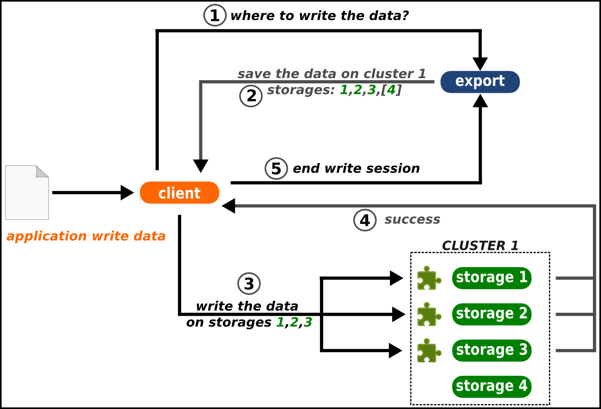

------------
About RozoFS
------------

RozoFS is scale-out NAS. This software solution offers a *high
performance* storage solution while ensuring high *data availability* of
your business. RozoFS can easily and economically store a large volume
(up to petabytes) of data by aggregating storage resources from
heterogeneous servers. RozoFS uses erasure coding to ensure *high
availability* of data while optimizing the raw storage capacity used.
RozoFS is free software licensed under the GNU GENERAL PUBLIC LICENSE
version 2 (GNU GPL 2.0).

RozoFS provides a native POSIX file system. The particularity of RozoFS
lies in how data are stored. Before being stored, data are cut into a
multitude of smaller pieces of information. These chunks are transformed
using erasure coding into encoded fragments we call projections. These
projections are then distributed and stored on different available
storage servers. The data can then be retrieved (decoded) even if
several projections (servers) are unavailable. Note that this mechanism
adds a level of *confidentiality* to the system: the projections are not
**usable individually**.

The redundancy method based on coding techniques that is used by RozoFS
allows for large storage savings compared to traditional *replication*
method.

RozoFS Fundamentals
===================

The file system itself comprises three components:

-  *exportd* - metadata servers manage the location of chunks (ensuring
   the best capacity load balancing with respect to high availability),
   file access and namespace (hierarchy). Multiple replicated metadata
   servers are used to provide failover.

-  *storaged* - storage server storing the chunks.

-  *rozofsmount* - clients communicating with both export servers and
   chunk servers. They are responsible for data transformation.

Beyond the scale out architecture, RozoFS was designed to provide high
performance and scalability using single-process event-driven
architecture and non-blocking calls to perform asynchronous I/O
operations. All RozoFS components can run on the same physical hosts. A
RozoFS single node setup can be useful for testing purpose. In
production environment it is not unusual to have hosts running
**exportd**, **storaged** and **rozofsmount**.

Storage nodes and storaged daemon
---------------------------------

Each storage node hosts a storaged daemon and configures itself via a
configuration file. This daemon receives requests and stores the
converted data files. A **storaged** can manage several storage
locations. These storage locations are physical storages (e.g. disks,
partitions or even remote file systems) accessed through an usual file
system (e.g. ext4, btrfs, zfs ...) where storaged can read and write
projections.

Export nodes and exportd daemon
-------------------------------

An export node includes all the information needed to reconstruct all
the data it holds. It runs an exportd daemon configured by a
configuration file describing three fundamental concepts in RozoFS :
**volume**, **layout** and **export**.

Volume and their clusters
~~~~~~~~~~~~~~~~~~~~~~~~~

A volume in RozoFS can be seen as a usable capacity. It is defined by a
pool of storage locations. These storage locations are themselves
gathered by **clusters**. These clusters in RozoFS provide load
balancing based on effective capacity. When RozoFS needs to store
projections on a volume, it will select the cluster with the larger free
space and then the storage locations within this cluster on the same
criteria. This ensures a good capacity repartition without any lost
space due to small nodes that could be full. This design was selected
with scalability in mind. Today, nodes are less capacitive than the ones
you would add in the future. The only requirement on volume takes place
upon a volume creation: it must at least contain one cluster holding at
least enough storage locations handling the same capacity, according to
the erasure coding parameters (see below). Even if a volume can be
extended with the number of storage locations you need, a good practice
is to scale with the same requirements. In the same way, the
administrator is invited not to create clusters with storage locations
on the same physical node, at risk of compromising the data availability
upon node failure.

An **exportd** can manage several **volumes**. Obviously, a storage node
can hold storage locations belonging to different volumes.

Layouts
~~~~~~~

As previously mentioned, RozoFS introduces redundancy to ensure high
**reliability**. This reliability depends on the chosen configuration.
The number of storage servers used and the reliability you need are the
two criteria which determine the best configuration to use. While
redundancy tweaking might be possible, in RozoFS the default redundancy
level is set to 1.5. RozoFS generates n projections, and only m among
them are required to rebuild the data with n / m = 1.5. This redundancy
level has been chosen for its availability equivalent with *3-way
replication*. Based on that, three redundancy configurations called
layout have been defined in RozoFS. A **layout** in RozoFS is defined by
a tuple (m,n,s) with m corresponding to the number of projections
required to rebuild the data, n the number of generated projections, and
s the number of possible storage locations that can be used to store
projections. The purpose of the s value is about ensuring high
availability in write operations : RozoFS will only consider a write
safe if and only if it has been able to store n fragments. To do so,
there must have enough storage locations available where to distribute
the projections in order to tolerate failures of some of them. In the
exportd configuration file, these layouts are identified by integers
(from 0 to 2) and we call them layout\_0, layout\_1 and layout\_2 in
this guide:

-  *layout\_0*: (2, 3, 4)

-  *layout\_1*: (4, 6, 8)

-  *layout\_2*: (8, 12, 16)

Note: as explained in the previous section, a good practice is to
organize storage locations of a cluster on different physical nodes,
thus the layouts are linked with the physical infrastructure of the
storage platform, especially with the number of nodes required to start
and to scale.

Exports
~~~~~~~

Volumes are the raw storage space on which several file sytems can be
created (called exports) and exposed to clients. Exports can be declared
or removed any time. Each export shares the raw capacity offered by its
volume that can be managed through resizable quotas (hard and soft).

The rozofsmount clients
-----------------------

``rozofsmount`` allows users to **mount an export** of the RozoFS file
system on a local directory using the FUSE library. Once the file system
is mounted, RozoFS usage is transparent to the user. ``rozofsmount`` is
responsible for data transformation and determines a set of storage
servers for read and write operations.

RozoFS Data Flow
================

The following figures shows the read and write process in RozoFS. The
**client** who wants to store a file first sends a request to the
**exportd** to ask for the list of **storage locations** (nodes if good
practices are respected) that must be used, then rozofsmount splits the
file into a number of blocks (according to RozoFS block size e.g. 8192B)
each block is then **encoded** and each resulting projection is sent to
a storage location. During this write process, rozofsmount is
responsible for choosing running storage locations among the possible
ones to ensure data availability. Failures of storage locations
(according to layout) are transparent for upper level (OS).

.. figure:: pics/data_flow_read.png
   :align: center
   :alt: 

During the read operation, the opposite process is performed. The
rozofsmount requests the list of storage locations used for each block
of data stored and retrieves a sufficient set of projections to
**rebuild** the block before transmitting it to the application level.
The redundancy introduced during the write operation ensures a reliable
storage despite any single or multiple failure of storage nodes
(depending on the layout chosen for redundancy).

RozoFS Data Protection
======================

RozoFS is fully redundant. It takes care of managing both metadata and
data with the same availability. However availability is handled in two
different ways: metadata are small and are accessed frequently and
highly structured (as in transactional systems) while data are huge and
unstructured (and rather an I/O problem).

That is the reason why RozoFS uses well known replication for metadata,
and active standby clusters technologies. Otherwise, for huge data it
applies erasure coding.

Meta Data Protection
--------------------

The metadata server (exportd) is a single point of potential failure
(SPOF). A high-availability strategy is necessary to be transparent to
the failure of one or more servers hosting the exportd service.

The DRBD (Distributed Replicated Block Device) software allows the
system to synchronize data, block by block, through the network between
two servers. This disk partition is used by only one server at a time
(the elected master server), and it is on this server that the service
exportd is active. The cluster management software Pacemaker controls
the different machines in the cluster and takes the necessary measures
in case of problem on any of them (failover IP address, boot order mof
services, etc).

Data Protection
---------------

A distributed system as RozoFS must protect the user data. Since this
kind of system relies on several nodes (from tens to thousands), the
risk of failures is a common factor. Failure sources are manifold.
Hardware components might fail (network, disks, power management ...) as
well as software components (bugs, operating system, expected upgrades ...). In order to protect data, RozoFS relies on an erasure code that uses
the *Mojette* mathematic transform.

Erasure Code vs Replication
~~~~~~~~~~~~~~~~~~~~~~~~~~~

Traditionally, fault-tolerance is managed by **replication** of data.
Blocks of information are replicated into several copies. A 3-way
replication produces 3 copies for each block of information. In this
case the system is able to cope with 2 failures. These replicated
fragments are then distributed to the storage nodes of the system. Upon
user access to a file, the system reads blocks of information that
correspond to the file. A failure occurs when a block is not accessible
by the system. In this case, the system switches its access to another
copy of the block, stored in another storage node. Consider now a system
that holds 3 petabytes of data, that needs to be protected against
failures. A system based on a 3-way replication approach requires 3
times the amount of the user data. It means that your protected system
consumes 9 petabytes of protected data!

There is an alternative, called erasure coding. Erasure coding aims at
**reducing the storage overhead** that involves fault-tolerance up to
50% compared to replication. Consider now that your k chunks of
information are encoded into n fragments (k<n). These fragments are then
distributed to the storage nodes of your system. When a user wants to
access a file, the system needs to read any k fragments among the n it
produced in order to rebuild the file. It means that if a fragment is
not accessible because of a failure, the system can pick another one.
Considering storage capacity in the previous example of a 2
fault-tolerant system, erasure coding transforms your 3 petabytes into
4.5 petabytes. With the same reliability, erasure code saved 1.5
petabytes compared to replication

Mojette Transform
~~~~~~~~~~~~~~~~~

Different kinds of erasure codes exist. The most popular ones are the
Reed-Solomon codes, but their implementations often lack performance.
RozoFS relies on an erasure code based on the Mojette transform, which
is a discrete version of the *Radon transform*. It is a mathematical
tool designed formerly for tomography but it has applications in a lot
of domain, especially in erasure coding.

Let consider our data set in a squared array where each row represents a
block and where lines depend on the size of blocks. The *Mojette*
transform defines linear combinations of the data. When a user wants to
write a file on RozoFS, the system **encodes** its information.
Basically, the encoder simply computes additions between different bits
in this array to produce redundant data. These additions follow a
certain pattern depending on the angles of projections. In RozoFS, it is
the layout that defines the number of projections and their angle. We
call these additions "bins" which are the elements that compose a
projection. After the projections are computed, RozoFS distributes these
encoded blocks to the storage nodes.

Consider now a user that need to access some information. Reading a file
is realised by the system as decoding information. It is possible to
invert the transform as we know the pattern. Only a subpart of the
projections is sufficient to retrieve the data (we saw previously the
gain in storage capacity). If enough projections are accessible, the
system is able to **decode**. Decoding is the process that fills an
empty array from the bins of projections, knowing the pattern used. We
consider that the system has rebuilt the data once the array is fully
filled.

The *Mojette* transform guarantees **high performance**. First, it
relies on simple additions. Encoding and decoding computations are
linear to the size of the array. This transform is a good tool to
protect data as the overhead of computations due to encoding and
decoding is low as well as the storage overhead.
