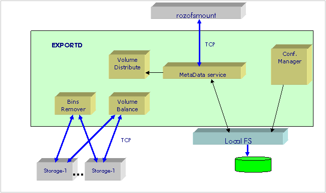
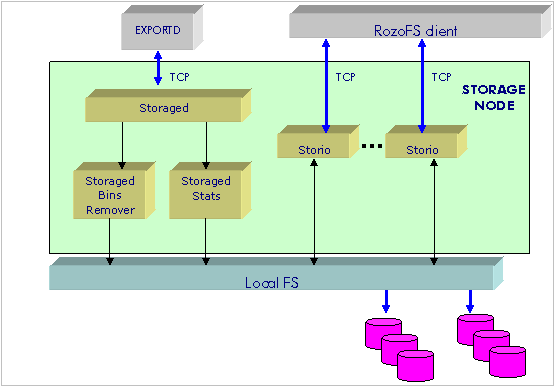

----------
Monitoring
----------

RozoFS comes with a command line tool called ``rozodiag`` that lets the
RozoFS administrator access a huge amount of **statistics**. Even though
these statistics are very helpful for troubleshooting and for diagnostic
(see section below) they might be far too detailed for an everyday
usage. For that purpose Fizians provides a simplified approach: *nagios
modules*. The ``rozodiag`` application is used by Nagios scripts to
provide high level informations related to the system health. The
communication with ``rozodiag`` is achieved thanks to TCP.

Rozodiag tools
==============

Introduction
------------

``rozodiag`` is an utilitary whose role is to provide statistics about
various resources of the RozoFS solution. Its goal is to provide
information that permits to observe the internals of each process and to
help in troubeshooting the RozoFS solution. The main information
provided by ``rozodiag`` are:

-  pseudo tasks statistics (activation times and average CPU time)

-  various statistics about disk read/write and truncate requests

-  TCP connections states and send/receive statistics

-  internal buffer resources statistics

-  per metadata services statistics

-  *FUSE* statistics

-  etc..

There is one *rozodiag* agent on each process of the RozoFS solution.

.. figure:: pics/rozodiag-overview.png
   :align: center
   :alt: 

The communication between *rozodiag* client and *rozodiag* agent is
based on TCP. There is a predefined set of TCP ports that are reserved
for the communication with the *rozodiag* agent. To address one
*rozodiag* agent the client should provide the IP address of the
*rozodiag* agent and the TCP port number of the target process
(*rozofsmount*, *storcli*, *exportd*, etc...).

List of the rozodiag agent ports
--------------------------------

The based TCP port for the *rozodiag* service is **50000**.

exportd node
~~~~~~~~~~~~

It is assumed that there is one *exportd* process per *exportd* node,
one *exportd* process supporting more than one exported file system. The
port value is the following:

-  *exportd*: **50000**

RozoFS client node
~~~~~~~~~~~~~~~~~~

There are 3 processes for one RozoFS client: *rozofsmount* and two
*storcli* processes.

It might be possible to instanciate more than one RozoFS Client on one
RozoFS client node, as a consequence the port numbering includes the
RozoFS client instance.

The following port numbers are given for the instance 0:

-  *rozofsmount*: **50003** (50003 + 3 \* client\_instance\_id)

-  *storcli-1*: **50004** (50004 + 3 \* client\_instance\_id)

-  *storcli-2*: **50005** (50005 + 3 \* client\_instance\_id)

storaged node
~~~~~~~~~~~~~

There is one *storaged* process (its role is to provided volume
occupancy, file deletion,..) and several *storio* processes that are
responsible of the low level disk operations (read, write and
truncated). For the case of the *storio*, the port value depends on the
*storio* instance identifier. The port values are the following:

-  *storaged*: **50027**

-  *storio-0*: **50028** (50028 + storio\_instance\_id)

-  *storio-1*: **50029** (50028 + storio\_instance\_id)

rozodiag usage
--------------

The following section provides the help of the ``rozodiag`` utilitary.

Here is the menu of ``rozodiag``. An external application can
communicate with any component of RozoFS by providing the IP address and
the RozoFS well-known *rozodiag* port associated with the component.

::

    rozodiag [-i <hostname>] -p <port> [-c <cmd>] [-f <cmd file>] [-period <s>] [-t <s>]
    -i <hostname>           destination IP address or hostname of the debug server
                            default is 127.0.0.1
    -p <port>               destination port number of the debug server
                            mandatory parameter
    -c <cmd|all>            command to run in one shot or periodically (-period)
                            several -c options can be set
    -f <cmd file>           command file to run in one shot or periodically (-period)
                            several -f options can be set
    -period <seconds>       periodicity for running commands using -c or/and -f options
    -t <seconds>            timeout value to wait for a response (default 4 seconds)

``rozodiag`` can operates in **interactive mode** or **one shot mode**:

-  **Interactive mode**:

   In that case we just need to provide the IP address and the TCP of
   *rozodiag* agent Once the TCP connection is established, the
   *rozodiag* agent displays the process's dedicated prompt and then
   waits for a command to be entered.

   ::

       # rozodiag -p 50004
       system : storcli 1 of rozofsmount 0
       _________________________________________________________
       storcli 1 of rozofsmount 0>

   Pressing the enter key provides the list of supported commands of the
   current *rozodiag* agent:

   ::

       List of available topics :
         af_unix
         buffer
         config_status
         cpu
         lbg
         lbg_entries
         profiler
         ps
         shaper
         shared_mem
         start_config
         storaged_status
         storcli_buf
         system
         tcp_info
         tmr_default
         tmr_set
         tmr_show
         trx
         uptime
         version
         who
         exit / quit / q

   Enter the ``exit``, ``quit`` or ``q`` command (topic) to exit from
   the *rozodiag* agent.

-  **One shot mode**:

   The one shot mode is used when ``rozodiag`` is invoked with the -c
   option. In that case the client opens the TCP connection, sends the
   commands to the *rozodiag* agent and finally closes the TCP
   connection.

   Here is an example where the ``cpu`` and ``buffer`` commands are
   combined:

   ::

       # rozodiag -p 50004 -c cpu -c buffer

       select max cpu time : 1000 us
       application                      sock  last  cumulated activation  average
       name                               nb   cpu        cpu      times      cpu  prio
       TMR_SOCK_XMIT                       4     0          0          0        0    0
       TMR_SOCK_RECV                       6    61       2061         31       66    0
       CNF_SOCK_XMIT                      15     0          0          0        0    0
       CNF_SOCK_RECV                      16     0          0          0        0    0
       DBG SERVER                         18    60         60          1       60    1
       C:localhost1/192.168.2.1:41000     21     0          0          0        0    3
       C:localhost2/192.168.2.2:41000     22     0          0          0        0    3
       C:localhost3/192.168.2.3:41000     23     0          0          0        0    3
       C:localhost4/192.168.2.4:41000     24     0          0          0        0    3
       L[U]:STORCLI_NORTH                 20     0          0          0        0    3
       A:STORCLI_NORTH                    26     0          0          0        0    3
       DBG 127.0.0.1                      27     0          0          0        0    2
       scheduler                           0     0          0          0        0
       NorthSmall - user data addr/len       0x17d55cc0 /    49152 - nb buff  48/ 48 size   1024
       NorthLarge - user data addr/len   0x2aaaab69e010 / 12681216 - nb buff  48/ 48 size 264192
       SouthSmall - user data addr/len       0x17d65010 /        4 - nb buff   1/  1 size      4
       SouthLarge - user data addr/len   0x2aaaac2e6010 /125829120 - nb buff 768/768 size 163840
       TxXmitSmall - user data addr/len       0x17d652a0 /        4 - nb buff   1/  1 size      4
       TxXmitLarge - user data addr/len       0x17d654c0 /        4 - nb buff   1/  1 size      4
       TxRcvSmall - user data addr/len       0x17d656e0 /        4 - nb buff   1/  1 size      4
       TxRcvLarge - user data addr/len   0x2aaab3b48010 /125829120 - nb buff 768/768 size 163840

Common rozodiag commands
------------------------

RPC buffer pools statistics
~~~~~~~~~~~~~~~~~~~~~~~~~~~

**buffer command**

That commands provides statistics related the buffer pools used by a
process.

The set of buffer pool is process dependant.

Output example:

::

    storcli 1 of rozofsmount 0> buffer
      NorthSmall - user data addr/len       0x17d55cc0 /    49152 - nb buff  48/ 48 size   1024
      NorthLarge - user data addr/len   0x2aaaab69e010 / 12681216 - nb buff  48/ 48 size 264192
      SouthSmall - user data addr/len       0x17d65010 /        4 - nb buff   1/  1 size      4
      SouthLarge - user data addr/len   0x2aaaac2e6010 /125829120 - nb buff 768/768 size 163840
     TxXmitSmall - user data addr/len       0x17d652a0 /        4 - nb buff   1/  1 size      4
     TxXmitLarge - user data addr/len       0x17d654c0 /        4 - nb buff   1/  1 size      4
      TxRcvSmall - user data addr/len       0x17d656e0 /        4 - nb buff   1/  1 size      4
      TxRcvLarge - user data addr/len   0x2aaab3b48010 /125829120 - nb buff 768/768 size 163840

Configuration status of the process
~~~~~~~~~~~~~~~~~~~~~~~~~~~~~~~~~~~

**config\_status command**

That command is accessible for each process that needs a configuration
synchronization with the *exportd* (typically the *storcli* process).

Output example:

::

    storcli 1 of rozofsmount 0> config_status
    root path    :/root/rozofs_git/develop_storio/tests/export_1  (eid:1)
    exportd host : localhost
    hash config  : 0x7ead7b85
         hostname        |  socket  | state  | cnf. status |  poll (attps/ok/nok) | conf send (attps/ok/nok)
    ---------------------+----------+--------+-------------+----------------------+--------------------------
               localhost |   19     |  UP    | SYNCED      | 001277/001277/000000 | 000001/000001/000000

**Field names:**

-  **root path**: root pathname of the export associated with the
   process.

-  **hash config**: current hash value of the configuration file. When
   the process detects that its current hash value is not the same as
   the one of its associated exportd, it has to reload the configuration
   from the exportd.

-  **cnf. status**: when the current configuration is synced with the
   one of the exportd, the state is SYNCED, otherwise the state is NOT
   SYNCED.

-  **poll**: in order to detect a change of configuration, the process
   polls the exportd. Rozodiag provides statistics about the number of
   poll attempts. When the "nok" counter is incremented, it is an
   indication of communication failure with the export: either the
   exportd is down or is unreachable.

-  **conf send**: that counter is an indication of the number of times
   the configuration has changed since the start-up of the process.

Storcli pseudo tasks statistics
~~~~~~~~~~~~~~~~~~~~~~~~~~~~~~~

**cpu command**

The goal of that service is to display statistics related to the pseudo
tasks associated with a dedicated process of the RozoFS solution.

Example with the case of the *exportd*:

::

    rozofsmount 0> cpu
    select max cpu time : 4089125414 us
    application                      sock       last  cumulated activation    average
    name                               nb        cpu        cpu      times        cpu  prio
    TMR_SOCK_XMIT                       8          0          0          0          0    0
    TMR_SOCK_RECV                       9          0     264236       4014         65    0
    CNF_SOCK_XMIT                      10          0          0          0          0    0
    CNF_SOCK_RECV                      11          0          0          0          0    0
    C:EXPORTD/127.0.0.1:606            12          0      12022         37        324    3
    DBG SERVER                         13          0       1092          2        546    1
    rozofs_fuse                         5          0      40536         38       1066    3
    C:EXPORTD/127.0.0.1:606            14       1000       1704         14        121    3
    DBG 127.0.0.1                       6          0          0          1          0    2
    C:STORCLI_1                        15          0          0          1          0    3
    L[U]:ROZO_DIRECT                   17          0          0          0          0    3
    scheduler                           0          0          0          0          0

**Field names:**

-  **sock nb**: index of the socket used by the application (local to
   the process).

-  **last cpu**: last activation cpu time in microseconds.

-  **cumulated cpu**: cumulative cpu time in microseconds since the last
   cpu command interrogation.

-  **activation times**: number of activation since the last cpu command
   interrogation.

-  **average cpu**: average cpu time in microseconds since the last cpu
   command interrogation.

-  **prio**: internal priority of the pseudo task.

Detailed statistics of load balancing group
~~~~~~~~~~~~~~~~~~~~~~~~~~~~~~~~~~~~~~~~~~~

**lbg command**

That command provides the detailed statistics for all the members of a
load balancing group.

Output example:

::

    storcli 1 of rozofsmount 0> lbg
    number of North Load Balancer contexts [size](initial/allocated) :[8984] 64/4
    NAME: localhost1                                 UP
          local/remote             : local
          size                     :            1
          total Up/Down Transitions:            1
          Main Queue               : EMPTY
       Entry[0]
           state                    :         UP
           Queue_entry              : EMPTY
           Cnx  Attempts            :            0
           Xmit messages            :           50
           Recv messages            :           50
           Xmit Perf. (count/time)  : 50 / 598 us / cumul 29949 us
      Cumulated
           total Xmit messages      :           50
           Main Xmit Queue Len      :            0
           total Xmit retries       :            0
           total Xmit aborted       :            0
           total Xmit error         :            0
           total Recv messages      :           50

Short statistics of load balancing group
~~~~~~~~~~~~~~~~~~~~~~~~~~~~~~~~~~~~~~~~

**lbg\_entries command**

That command provides short statistics about the configured load
balancing group of a process.

Output example:

::

    storcli 1 of rozofsmount 0> lbg_entries
      LBG Name                | lbg_id | idx  | sock |    state   |   Queue   | Cnx Attpts | Xmit Attpts | Recv count  |
    --------------------------+--------+------+------+------------+-----------+------------+-------------+-------------+
     localhost1               |     0  |   0  |   21 |         UP |     EMPTY |          0 |          50 |          50 |
     localhost2               |     1  |   0  |   22 |         UP |     EMPTY |          0 |          25 |          25 |
     localhost3               |     2  |   0  |   23 |         UP |     EMPTY |          0 |          50 |          50 |
     localhost4               |     3  |   0  |   24 |         UP |     EMPTY |          0 |           0 |           0 |

Process information
~~~~~~~~~~~~~~~~~~~

**ps command**

That command provides the process information equivalent to ``ps -ef``.

Output example:

::

    storcli 1 of rozofsmount 0> ps
      PID CPU     ELAPSED    VSZ COMMAND
      935  0.0       56:32 365828 storcli -i 1 -H localhost -E /root/rozofs_git/develop_storio/tests/export_1
                                          -M /root/rozofs_git/develop_storio/tests/mnt1 -D 50004 -R 0
                                          --nbcores 4 --shaper 0 -s 4 -k 1380932144 -l 263168 -c 32

TCP connections statistics
~~~~~~~~~~~~~~~~~~~~~~~~~~

That command provides a subset of the statistics of TCP connection as
returned by ``getsockopt()`` with the option TCP\_INFO.

Output example:

::

    storcli 1 of rozofsmount 0> tcp_info
      State      | Avail.|sock      |  retrans | probes   |  rto     | snd_mss  |  rcv_mss | unacked  |  lost    | retrans  |last_sent |   rtt    |
    -------------+-------+----------+----------+----------+----------+----------+----------+----------+----------+----------+----------+----------+
     ESTABLISHED |   YES |       21 |        0 |        0 |   202000 |    16384 |    16384 |        0 |        0 |        0 |   440411 |     2500 |
     ESTABLISHED |   YES |       22 |        0 |        0 |   201000 |    16384 |      536 |        0 |        0 |        0 |   447569 |     1875 |
     ESTABLISHED |   YES |       23 |        0 |        0 |   201000 |    16384 |    16384 |        0 |        0 |        0 |   440411 |     1875 |
     ESTABLISHED |   YES |       24 |        0 |        0 |   201000 |    16384 |      536 |        0 |        0 |        0 |  4132385 |     1000 |

**Field names:**

-  **state nb**: current state of the TCP connection.

-  **Avail.**: availability status of the TCP connection.

The status reflects the availability as seen by a RozoFS process.

In fact, in order react quickly to a change of state, RozoFS processes
implement a polling mechanism at RPC level to detect the availability of
the remote end. As a consequence, even if the TCP layer reports an
ESTABLISHED state, a RozoFS process might decide to not use the TCP
connection because of a lack of polling response.

RPC transactions statistics
~~~~~~~~~~~~~~~~~~~~~~~~~~~

**trx command**

That command provides statistics about the transactions contexts used
for RPC (Remote Procedure Call).

Output example:

::

    storcli 1 of rozofsmount 0> trx
    number of transaction contexts (initial/allocated) : 768/0
    context size (bytes)                               : 264
    Total memory size (bytes)                          : 202752
    Statistics
    TX_SEND           :          3
    TX_SEND_ERR       :          0
    TX_RECV_OK        :          3
    TX_RECV_OUT_SEQ   :          0
    TX_TIMEOUT        :          0
    TX_ENCODING_ERROR :          0
    TX_DECODING_ERROR :          0
    TX_CTX_MISMATCH   :          0
    TX_NO_CTX_ERROR   :          0
    TX_NO_BUFFER_ERROR:          0
    Buffer Pool (name[size] :initial/current
    Xmit Buffer
      small[     1]  :      1/1
      large[     1]  :      1/1
    Recv Buffer
      small[     1]  :      1/1
      large[163840]  :    768/768

**Field names:**

-  **TX\_SEND**: number of initiated transactions.

-  **TX\_SEND\_ERR**: that counter is incremented each time there is an
   error while attempting to initiate a transaction.

-  **TX\_RECV\_OK**: count of transactions received with no error

-  **TX\_RECV\_OUT\_SEQ**: number of received transactions that are out
   of sequence. Typically the case when a response is received after the
   expiration of the time-out associated with a transaction.

-  **TX\_TIMEOUT**: number of times the guard timer associated with a
   transaction has expired.

-  **TX\_ENCODING\_ERROR RPC**: encoding error counter.

-  **RX\_ENCODING\_ERROR RPC**: decoding error counter.

-  **TX\_CTX\_MISMATCH**: that counter is incremented each there is
   mismatched between the transaction id of a response and its
   associated transaction context.

-  **TX\_NO\_CTX\_ERROR**: that counter is incremented each time the
   transaction pool runs out of transaction context.

-  **TX\_NO\_BUFFER\_ERROR**: that counter is incremented each time a
   buffer pool runs out of buffer.

Process Uptime
~~~~~~~~~~~~~~

**uptime command**

That command provides the uptime of the process.

Output example:

::

    storcli 1 of rozofsmount 0> uptime
    uptime = 0 days, 0:58:55

rozodiag commands for exportd
-----------------------------

This section describes various ``rozodiag`` commands concerning the
*exportd* process.

File locking statistics
~~~~~~~~~~~~~~~~~~~~~~~

**flock command**

The following command provides the information relative to the file
locking.

Output example:

::

    exportd 1 > flock
    File lock statistics:
      nb_file_lock         = 0
      nb_client_file_lock  = 0
      nb_lock_allocate     = 0
      nb_lock_unlink       = 0
      nb_add_client        = 0
      nb_remove_client     = 0

Cache attributes statistics
~~~~~~~~~~~~~~~~~~~~~~~~~~~

**lv2\_cache command**

That command provides statistics related to the cache attributes of
metadata server.

Output example:

::

    exportd 1 > lv2_cache
    lv2 attributes cache : current/max 3/256
    hit 439 / miss 2 / lru_del 0
    entry size 160 - current size 480 - maximum size 40960

Metadata operations statistics
~~~~~~~~~~~~~~~~~~~~~~~~~~~~~~

**profiler\_short command: display of the metadata operations
statistics**

That command provides statistics all the metadata operations supported
by the *exportd*.

Output example:

::

    exportd 1 > profiler_short
    GPROFILER version 1.3.alpha8 uptime =  0 days, 16:25:14
       procedure              |     count       |  time(us) | cumulated time(us) |     bytes       |
    --------------------------+-----------------+-----------+--------------------+-----------------+
     ep_mount                 |               3 |       333 |               1000 |                 |
     ep_umount                |               0 |         0 |                  0 |                 |
     ep_statfs                |               1 |       111 |                111 |                 |
     ep_lookup                |             403 |        64 |              26025 |                 |
     ep_getattr               |              11 |       290 |               3194 |                 |
     ep_setattr               |               0 |         0 |                  0 |                 |
     ep_readlink              |               0 |         0 |                  0 |                 |
     ep_mknod                 |               2 |      1750 |               3501 |                 |
     ep_mkdir                 |               0 |         0 |                  0 |                 |
     ep_unlink                |               0 |         0 |                  0 |                 |
     ep_rmdir                 |               0 |         0 |                  0 |                 |
     ep_symlink               |               0 |         0 |                  0 |                 |
     ep_rename                |               0 |         0 |                  0 |                 |
     ep_readdir               |               0 |         0 |                  0 |                 |
     ep_read_block            |               0 |         0 |                  0 |               0 |
     ep_write_block           |              25 |        74 |               1863 |         6394854 |
     ep_link                  |               0 |         0 |                  0 |                 |
     ep_setxattr              |               0 |         0 |                  0 |                 |
     ep_getxattr              |               0 |         0 |                  0 |                 |
     ep_removexattr           |               0 |         0 |                  0 |                 |
     ep_listxattr             |               0 |         0 |                  0 |                 |
     get_mdirentry            |             405 |        28 |              11449 |                 |
     put_mdirentry            |               4 |      4704 |              18819 |                 |
     del_mdirentry            |               0 |         0 |                  0 |                 |
     list_mdirentries         |               0 |         0 |                  0 |                 |
     gw_invalidate            |               0 |         0 |                  0 |                 |
     gw_invalidate_all        |               0 |         0 |                  0 |                 |
     gw_configuration         |               0 |         0 |                  0 |                 |
     gw_poll                  |               0 |         0 |                  0 |                 |
     ep_clearclient_flock     |               1 |         0 |                  0 |                 |
     ep_clearowner_flock      |               0 |         0 |                  0 |                 |
     ep_set_file_lock         |               0 |         0 |                  0 |                 |
     ep_get_file_lock         |               0 |         0 |                  0 |                 |
     ep_poll_file_lock        |            1947 |        10 |              19644 |                 |

**Legend**:

-  **get\_mdirentry**: That service corresponds to the retrieving of a
   unique file/directory identifier from a "mdirent" file associated
   with the parent directory of the object to retrieve.

-  **put\_mdirentry**: That service corresponds to the insertion of a
   unique file identifier (FID) of a file/directory in the "mdirent"
   file associated with a parent directory.

-  **del\_mdirentry**: That service corresponds to the removing of a
   unique file identifier (FID) of a file/directory from the "mdirent"
   file associated with a parent directory. It is typically associated
   with the rdmir and unlink services.

**Metadata statistics clear**

The statistics of the Metadata server are cleared with the following
command:

::

    exportd 1 > profiler reset
    Reset Done

Volume management statistics
~~~~~~~~~~~~~~~~~~~~~~~~~~~~

**vfstat command**

That command provides detailed statistics related to each file system
exported supported by the current *exportd* process.

Output example:

::

    exportd 1 > vfstat
    Volume: 1  Bsize: 4096 Blocks: 9437728 Bfree: 676514 PercentFree: 7
    Sid    | Status | Capacity(B)          | Free(B)              |
    -------+--------+----------------------+----------------------+
         1 | UP     |          14496350208 |           1039126528 |
         2 | UP     |          14496350208 |           1039126528 |
         3 | UP     |          14496350208 |           1039126528 |
         4 | UP     |          14496350208 |           1039126528 |
    Eid    | Bsize  | Blocks               | Bfree                | Files        | Ffree        |
    -------+--------+----------------------+----------------------+--------------+--------------+
         1 |   4096 |               678076 |               676514 |            2 |      3282090 |

**vfstat\_exp command**

That command is the same as the previous one, without the details
related to the sids (storage nodes).

Output example:

::

    exportd 1 > vfstat_exp
    Eid    | Vid    | Bsize  | Blocks               | Bfree                | Files        | Ffree        |
    -------+--------+--------+----------------------+----------------------+--------------+--------------+
         1 |      1 |   4096 |               678076 |               676514 |            2 |      3282090 |

rozodiag commands for rozofsmount
---------------------------------

This section describes various ``rozodiag`` commands concerning the
*rozofsmount* process.

.. figure:: pics/rozodiag-rozofsmount.png
   :align: center
   :alt: 

File caching mode
~~~~~~~~~~~~~~~~~

**Caching Mode overview**

``rozofsmount`` supports 3 caching modes:

-  **standard**: Default mode of rozofsmount. With that configuration
   VFS can cache the data.

-  **direct io**: In that mode the amount a data requested for a read is
   directly passed to *rozofsmount*. There is no caching neither at
   *FUSE* level nor VFS level.

-  **keep cache**: With that option, the Linux kernel can keep the data
   in its cache. That option can be used only when RozoFS operates in
   blockmode. Typically when the file can be read/write by a unique
   source.

The cache mode applies at file opening time only. Changing the cache
mode on the fly will not impact the files that are already opened.

**Caching mode display**

The current cache mode is displayed thanks the ``fuse`` *rozodiag*
command:

::

    rozofsmount 0> fuse
    FUSE  running - 32/32 ctx remaining
    FS Mode    : standard
    cache Mode : default
    cpt_0:        0
    cpt_1:        0
    cpt_2:        0
    cpt_3:        0
    cpt_4:        0
    cpt_5:        0
    cpt_6:        0
    cpt_7:        0
    cpt_8:        0
    cpt_9:        0
    cpt_10:        0
    flush buf. count:        0
    readahead  count:        0
    read req.  count:        0
    read fuse  count:        0
    Per Read Array statitics:
    Per Write Array statitics:

**Setting the RozoFS caching mode**

The following command permits to change the current caching mode of the
*rozofsmount* client. The caching mode does not affect the already
opened files. It will be effective for any file that is opened after the
change of mode. That command takes place in memory only. Restarting
*rozofsmount* implies that *rozofsmount* reverts back to its initial
configuration.

Output example:

::

    rozofsmount 0> cache_set
    usage:
    cache_set {0|1|2}
       0: no option on open/create
       1: direct_io
       2: keep_cache

File lock statistics
~~~~~~~~~~~~~~~~~~~~

RozoFS supports BSD and POSIX file locking services. The following
command displays statistics related to the file locking.

::

    rozofsmount 0> flock
    bsd_set_passing_lock     = 0
    bsd_set_blocking_lock    = 0
    posix_set_passing_lock   = 0
    posix_set_blocking_lock  = 0
    set_lock_refused         = 0
    set_lock_success         = 0
    set_lock_error           = 0
    set_lock_interrupted     = 0
    posix_get_lock           = 0
    get_lock_refused         = 0
    get_lock_success         = 0
    get_lock_error           = 0
    enoent                   = 0
    enomem                   = 0
    einval                   = 0
    send_common              = 0

Statistics related to storcli interface
~~~~~~~~~~~~~~~~~~~~~~~~~~~~~~~~~~~~~~~

**Storcli load balancing statistics**

That command provides statistics about the load balancing of the
read/write and truncate requests towards the *storcli* processes
attached to the *rozofsmount* process. Output example:

::

    rozofsmount 0> stclbg
    number of configured storcli: 1
    storcli 0: 50
    storcli 1: 0
    hit/miss/insert 1/49/50

**Legend**:

-  **storcli i**: These counters reflect the number of requests
   submitted per *storcli* process.

-  **hit**: That counter is incremented each time there is a read/write
   or truncate in progress request with the same FID (the FID being the
   unique identifier associated with a file).

   When there is a hit, the *rozofsmount* queues the request towards the
   *storcli* on which it founds the FID.

-  **miss**: That counter is incremented each time there is no match for
   the FID. It is the case where there is no pending request for the FID
   associated with the file.

   In that case *rozofsmount* selects the next *storcli* process to use
   in a round-robin way.

-  **insert**: That counter is incremented for each request submitted to
   a *storcli*

**Shared memory statistics**

By default *rozofsmount* uses one shared memory per *storcli* for the
read operation. That option is selected at *rozofsmount* start-up (note:
it might be possible to work without shared memory). The following
command provides information related to the shared memory owns by
*rozofsmount*:

::

    rozofsmount 0> shared_mem
    storcli  |     key     |  size    | count |    address     | read stats     |
    ---------+-------------+----------+-------+----------------+----------------+
         0   | 1380932144  | 00263168 |  32   | 0x2aaaaaaab000 |             25 |
         1   | 1380932145  | 00263168 |  32   | 0x2aaaab2b3000 |              0 |

**Legend**:

-  **storcli**: index of the *storcli*.

-  **key**: key of the shared memory as reported by Linux.

-  **size**: size of a read buffer within the shared memory.

-  **count**: number of buffers supported by the shared memory.

-  **read stats**: number of times the shared memory has been used for
   reading.

Read/Write statistics at the FUSE interface
~~~~~~~~~~~~~~~~~~~~~~~~~~~~~~~~~~~~~~~~~~~

**fuse command**

That command provides statistics about the read/write operations
triggers by VFS towards *rozofsmount* across FUSE interface.

That command operates in read and clear mode.

Output example:

::

    rozofsmount 0> fuse
    FUSE  running - 32/32 ctx remaining
    FS Mode    : standard
    cache Mode : default
    cpt_0:        0
    cpt_1:        0
    cpt_2:        0
    cpt_3:        0
    cpt_4:        0
    cpt_5:        0
    cpt_6:        0
    cpt_7:        0
    cpt_8:        0
    cpt_9:        0
    cpt_10:        0
    flush buf. count:       25
    readahead  count:       23
    read req.  count:       25
    read fuse  count:       51
    Per Read Array statitics:
       16384:        2
       32768:        1
       65536:        1
      131072:       47
    Per Write Array statitics:
        4096:     1562

**Legend**:

-  **Per Write Array statitics**: Provides statistics by range size
   (aligned on a 4K boundary).

-  **Per Read Array statitics**: Provides statistics by range size
   (aligned on a 4K boundary).

-  **read fuse count**: Number of read requests submitted at the
   interface between FUSE and *rozofsmount*.

-  **read req. count**: Number of read requests submitted at the
   interface between *rozofsmount* and *storcli*.

-  **readahead count**: Number of read requests submitted at the
   interface between *rozofsmount* and *storcli* because of readahead.

-  **flush buf. count**: Number of times a internal write buffer has
   been flushed towards a storage node.

Statistics at the FUSE interface
~~~~~~~~~~~~~~~~~~~~~~~~~~~~~~~~

**profiler command: statistics display**

That command provides statistics about al the fuse low-level operations
supported by *rozofsmount*.

Output example:

::

    rozofsmount 0> profiler
    GPROFILER version 1.3.alpha8 uptime =  0 days, 5:51:51
      -ientry counter: 3
       procedure  |     count       |  time(us) | cumulated time(us) |     bytes       |
    --------------+-----------------+-----------+--------------------+-----------------+
     lookup       |             403 |       378 |             152631 |                 |
     forget       |               0 |         0 |                  0 |                 |
     getattr      |               6 |      2470 |              14821 |                 |
     setattr      |               0 |         0 |                  0 |                 |
     readlink     |               0 |         0 |                  0 |                 |
     mknod        |               0 |         0 |                  0 |                 |
     mkdir        |               0 |         0 |                  0 |                 |
     unlink       |               0 |         0 |                  0 |                 |
     rmdir        |               0 |         0 |                  0 |                 |
     symlink      |               0 |         0 |                  0 |                 |
     rename       |               0 |         0 |                  0 |                 |
     open         |               1 |      1000 |               1000 |                 |
     link         |               0 |         0 |                  0 |                 |
     read         |              51 |      3073 |             156739 |         6291456 |
     write        |            1562 |        74 |             116226 |         6394854 |
     flush        |               3 |      2537 |               7611 |                 |
     release      |               3 |       333 |               1000 |                 |
     opendir      |               0 |         0 |                  0 |                 |
     readdir      |               0 |         0 |                  0 |                 |
     releasedir   |               0 |         0 |                  0 |                 |
     fsyncdir     |               0 |         0 |                  0 |                 |
     statfs       |               0 |         0 |                  0 |                 |
     setxattr     |               0 |         0 |                  0 |                 |
     getxattr     |               0 |         0 |                  0 |                 |
     listxattr    |               0 |         0 |                  0 |                 |
     removexattr  |               0 |         0 |                  0 |                 |
     access       |               0 |         0 |                  0 |                 |
     create       |               2 |      2479 |               4959 |                 |
     getlk        |               0 |         0 |                  0 |                 |
     setlk        |               0 |         0 |                  0 |                 |
     setlk_int    |               0 |         0 |                  0 |                 |
     clearlkowner |               0 |         0 |                  0 |                 |
     ioctl        |              25 |       848 |              21205 |                 |

**Legend**:

-  **ientry counter**: Provides statistics about the number of inodes
   currently used by *rozofsmount*.

**Statistics clear**

The *rozofsmount* statistics can be cleared using the following command:

::

    rozofsmount 0> profiler reset
    Reset Done

rozodiag commands for storcli
-----------------------------

This section describes various ``rozodiag`` commands concerning the
*storcli* process.

.. figure:: pics/rozodiag-storcli.png
   :align: center
   :alt: 

Pseudo tasks statistics
~~~~~~~~~~~~~~~~~~~~~~~

**List of the storcli pseudo tasks**

The list of these tasks can be retrieved by using the ``cpu`` command:

::

    rozodiag -p 50004 -c cpu

The port number depends of the instance of the storcli and on the
instance of the *rozofsmount* client that owns the *storcli*. For the
*rozofsmount* instance 0 the storcli's port numbers are:

-  **50004**: *storcli* instance 0.

-  **50005**: *storcli* instance 1.

The following output example corresponds to a configuration where the
*storcli* is connected with 4 storage nodes:

::

    storcli 1 of rozofsmount 0> cpu
    select max cpu time : 4089953392 us
    application                      sock       last  cumulated activation    average
    name                               nb        cpu        cpu      times        cpu  prio
    TMR_SOCK_XMIT                       3          0          0          0          0    0
    TMR_SOCK_RECV                       6          0     971005      18889         51    0
    CNF_SOCK_XMIT                      15          0          0          0          0    0
    CNF_SOCK_RECV                      16          0          0          0          0    0
    DBG SERVER                         18       3999       3999          1       3999    1
    C:localhost1/192.168.2.1:41000     21         39      49924         89        560    3
    C:localhost2/192.168.2.2:41000     22          0      51618         41       1258    3
    C:localhost3/192.168.2.3:41000     23          0          0          1          0    3
    C:localhost4/192.168.2.4:41000     24         13      39946         85        469    3
    L[U]:STORCLI_NORTH                 20        729        729          1        729    3
    A:STORCLI_NORTH                    26        170     262654         98       2680    3
    DBG 127.0.0.1                      27          0          0          1          0    2
    scheduler                           0          0          0          0          0

**Legend**:

-  **storages TCP connection**: There is one TCP connection per
   configured storage node. That TCP connection is used by the *storcli*
   to send read/write and truncate requests.

   When the number of TCP connections is less than the number of
   storages configured for the *storcli*, one of the possible causes is
   the following:

   -  remote storage server is down ;

   -  communication path is broken: check for ethernet ports states on
      servers and switches.

-  **Listening port**: There only one listening port (STORCLI\_NORTH)
   and it must have only one client that attempts to connect. The client
   is always the *rozofsmount* that owns the *storcli*. The connection
   is an AF\_UNIX stream.

   The lack of "A:STORCLI\_NORTH" in the display indicates that the
   connection is broken between the *storcli* and its associated
   *rozofsmount*. That situation must not occur.

Read/Write statistics
~~~~~~~~~~~~~~~~~~~~~

**Profiler statistics display**

That command provides statistics related to the read/write and truncate
services. For the case of the read and write it provides the FEC
encoding/decoding time.

::

    rozodiag -p 50004 -c profiler

Output example:

::

    GPROFILER version  uptime =  0 days, 0:58:41
       procedure      |     count        |  time(us)  | cumulated time(us)  |     bytes       |
    ------------------+------------------+------------+---------------------+-----------------+
     read             |              41  |      5967  |             244678  |        10502144 |
     Mojette Inv      |              41  |       379  |              15569  |               0 |
     read_prj         |              82  |      4645  |             380945  |        10563680 |
     read_prj_err     |               0  |         0  |                  0  |                 |
     read_prj_tmo     |               0  |         0  |                  0  |                 |
     write            |              40  |     15833  |             633347  |        10485760 |
     Mojette Fwd      |              40  |       777  |              31084  |               0 |
     write_prj        |             120  |      9692  |            1163124  |        15820800 |
     write_prj_tmo    |               0  |         0  |                  0  |                 |
     write_prj_err    |               0  |         0  |                  0  |                 |
     truncate         |               0  |         0  |                  0  |               0 |
     truncate_prj     |               0  |         0  |                  0  |               0 |
     truncate_prj_tmo |               0  |         0  |                  0  |                 |
     truncate_prj_err |               0  |         0  |                  0  |                 |

**Legend**:

-  **Read statistics**:

   Provides statistics and error counters related to the read process.
   The "count" corresponds to the number of times the function is
   called. There is relation between the count of "read" and
   "read\_prj": "read\_prj" must be n times "read", where "n" depends on
   the configured layout : 2 for Layout 0 and 4 for layout 1.

   -  **read**: it corresponds to the time that has been spent between
      the initiation of the read towards the different storage nodes
      (according to the file distribution until the full rebuilt of the
      requested payload (between 1..32 User Data Blocks),

   -  **Mojette Inv**: It corresponds to the rebuild time of a set of
      User Data Block (between 1 and 32).

   -  **read\_prj**: It corresponds to the time spent for a read request
      handshake with one storage. Typically, under nominal condition it
      represents the line time and the disk read time.

   -  **read\_prj\_err**: It is a counter that is incremented each time
      a storage node reports a read error towards the *storcli*.
      Typically, that counter is incremented when the *storcli* attempts
      to read a projection from a spare storage that has never been
      used.

      That might happen in case of a read projection time-out, in that
      case the *storcli* issues a read request towards all the remaining
      storage of the distribution set of a file, an thus it might
      address some spare storage that has not been used yet.

      That counter is also incremented if the storcli cannot find enough
      projections to rebuild a User Data Block. This corresponds to a
      situation where more than one storage of the file's distribution
      set are inaccessible. This can be a either a temporary error
      (typically a network failure) or a permanent failure (the disk(s)
      of the storage are damaged). In the lastest situation the file is
      lost.

   -  **read\_prj\_tmo**: It is a counter that is incremented each time
      the storage node does not respond in the configured time frame.

-  **Write statistics**:

   -  **write**:

   -  **Mojette Fwd**:

   -  **write\_prj**:

   -  **write\_prj\_tmo**:

   -  **write\_prj\_err**:

-  **Truncate statistics**:

   -  **truncate**:

   -  **truncate\_prj**:

   -  **truncate\_prj\_tmo**:

   -  **truncate\_prj\_err**:

**Profiler statistics clear**

The profiler statistics can be cleared by using the following command:

::

    rozodiag -p 50004 -c profiler reset

Storage Node connection status
~~~~~~~~~~~~~~~~~~~~~~~~~~~~~~

**storaged\_status command: Storcli North Contexts/Buffers statistics**

That commands provides information related to the TCP connection towards
the storage nodes that are used by the *storcli* process. The state
information is displayed for each cluster id (cid) and for each storaged
id within a cluster (sid).

The individual TCP connection associated to each load balancing group is
not displayed with that command.

If details about the connection of load balancing group is needed,
please use either the ``lbg`` or ``lbg_entries`` command for detailed
status.

Output example:

::

    storcli 1 of rozofsmount 0> storaged_status
     cid  |  sid |      hostname        |  lbg_id  | state  | Path state | Sel | tmo   | Poll. |Per.|  poll state  |
    ------+------+----------------------+----------+--------+------------+-----+-------+-------+----+--------------+
     001  |  01  | localhost1           |    0     |  UP    |  UP        | YES |     0 |     0 | 50 |  IDLE        |
     001  |  02  | localhost2           |    1     |  UP    |  UP        | YES |     0 |     0 | 50 |  IDLE        |
     001  |  03  | localhost3           |    2     |  UP    |  UP        | YES |     0 |     0 | 50 |  IDLE        |
     001  |  04  | localhost4           |    3     |  UP    |  UP        | YES |     0 |     0 | 50 |  IDLE        |

**Legend**:

-  **cid**: cluster identifier.

-  **sid**: storage identifier within the cluster.

-  **hostname**: hostname of the storaged node.

-  **lbg\_id**: load balancing group identifier.

-  **state**: state of the load balancing group according to TCP.

-  **Path state**: Application path state. UP state indicates that there
   is at least one TCP connection of the load balancing group for which
   the storcli gets poll answser from the storaged node.

-  **Sel**: that field indicates if the load balancing group can be
   selectable for read/write request. Typically when the path state is
   down, the load balancing group is not selectable.

North read/write buffer statistics
~~~~~~~~~~~~~~~~~~~~~~~~~~~~~~~~~~

**storcli\_buf command: Storcli North Contexts/Buffers statistics**

That command provides information related to the contexts that are used
at the North Interface of a *storcli* to process the requests submitted
by the *rozofsmount* client (Read/Write/Truncate).

Output example:

::

    storcli 1 of rozofsmount 0> storcli_buf
    number of transaction contexts (initial/allocated) : 48/0
    Statistics
    req serialized :          2
    serialize mode : NORMAL
    SEND           :          0
    SEND_ERR       :          0
    RECV_OK        :          0
    RECV_OUT_SEQ   :          0
    RTIMEOUT       :          0
    EMPTY READ     :       1540
    EMPTY WRITE    :       1536
    Buffer Pool (name[size] :initial/current
    North interface Buffers
      small[  1024]  :     48/48
      large[264192]  :     48/48
    South interface Buffers
      small[     1]  :      1/1
      large[163840]  :    768/768

**Legend**:

-  **req serialized**: That counter is incremented each time there is
   already an in progress read/write truncate request for the same file.
   In fact, a *storcli* process serializes the requests concerning the
   same file to avoid collision between a read and a write.

-  **serialize mode**: must always be NORMAL.

-  **SEND, SEND\_ERR, RECV\_OK, RECV\_OUT\_SEQ, RTIMEOUT**: These
   counters are not used. Use command ``trx`` instead to get information
   about transactions initiated by the *storcli* towards the storage
   nodes.

-  **EMPTY READ**: That counter is incremented each time *storcli*
   detects a read buffer which is filled with 0 only. The goal of the
   detection is to avoid applying the Erasure Coding on an empty buffer.

-  **EMPTY WRITE**: That counter is incremented each time *storcli*
   detects a write buffer which is filled with 0 only.

rozodiag commands for storaged/storio
-------------------------------------

This section describes various ``rozodiag`` commands concerning the
*storaged*/*storio* processes.

Disk threads statistics
~~~~~~~~~~~~~~~~~~~~~~~

That command provides statistics relative to the disk read/write at
thread level.

Output example:

::

    storio localhost1> diskThreads
    Thread number            |                0 |                1 |                2 |            TOTAL |
    Read Requests            |__________________|__________________|__________________|__________________|
       number                |               14 |                2 |                9 |               25 |
       Unknown cid/sid       |                0 |                0 |                0 |                0 |
       error spare           |                0 |                0 |                0 |                0 |
       error                 |                0 |                0 |                0 |                0 |
       Bytes                 |          1732192 |           265216 |          1193472 |          3190880 |
       Cumulative Time (us)  |            11032 |             1473 |             6167 |            18672 |
       Average Bytes         |           123728 |           132608 |           132608 |           127635 |
       Average Time (us)     |              788 |              736 |              685 |              746 |
       Throughput (MBytes/s) |              157 |              180 |              193 |              170 |
    Write Requests           |__________________|__________________|__________________|__________________|
       number                |                4 |                1 |               20 |               25 |
       Unknown cid/sid       |                0 |                0 |                0 |                0 |
       error                 |                0 |                0 |                0 |                0 |
       Bytes                 |           451696 |           132608 |          2652160 |          3236464 |
       Cumulative Time (us)  |             7998 |             1075 |            22997 |            32070 |
       Average Bytes         |           112924 |           132608 |           132608 |           129458 |
       Average Time (us)     |             1999 |             1075 |             1149 |             1282 |
       Throughput (MBytes/s) |               56 |              123 |              115 |              100 |
    Truncate Requests        |__________________|__________________|__________________|__________________|
       number                |                0 |                0 |                0 |                0 |
       Unknown cid/sid       |                0 |                0 |                0 |                0 |
       error                 |                0 |                0 |                0 |                0 |
       Cumulative Time (us)  |                0 |                0 |                0 |                0 |
       Average Time (us)     |                0 |                0 |                0 |                0 |
                             |__________________|__________________|__________________|__________________|

Global read/write disk statistics
~~~~~~~~~~~~~~~~~~~~~~~~~~~~~~~~~

**profiler command**

That command provides statistics relative to the disk read/write at
thread level.

Output example:

::

    storio localhost1> profiler
    GPROFILER version 1.3.alpha8 uptime =  0 days, 1:46:58
     OP               | CALL         | RATE(msg/s)  | CPU(us)      | COUNT(B)     | THROUGHPUT(MB/s) |
    ------------------+--------------+--------------+--------------+--------------+------------------+
     read             | 25           | 549          | 1819         | 3190880      | 65               |
     write            | 25           | 446          | 2241         | 3236464      | 53               |
     truncate         | 0            | 0            | 0            | 0            | 0                |

**Statistics reset**

The read/write statistics can be clear with the following command:

::

    storio localhost1> profiler reset

RPC statistics
~~~~~~~~~~~~~~

**rpc\_resources command**

That command provides statistics for all the transactions received by a
*storio* process. It cumulates the read/write and truncate transactions.

Among the information displayed only the information related to the
transactions are significant. The default buffer pool of the RPC service
are not used by the *storio*. Please use command ``buffer`` to get
information related to the current buffer usage of the *storio*.

Output example:

::

     <storio localhost1>=""> rpc_resources
    number of rpc contexts (initial/allocated) : 8/0
    Statistics
    SEND           :         50
    SEND_ERR       :          0
    RECV_OK        :         50
    RECV_OUT_SEQ   :          0
    ENCODING_ERROR :          0
    DECODING_ERROR :          0
    NO_CTX_ERROR   :          0
    NO_BUFFER_ERROR:          0
    Buffer Pool (name[size] :initial/current
    North interface Buffers
      small[  1024]  :      8/8
      large[ 38912]  :      8/8
    South interface Buffers
      small[     1]  :      1/1
      large[  8192]  :      8/8

**buffer command: Storio Buffer pool statistics**

::

    storio localhost1> buffer
       rpcDecodedRequest - user data addr/len        0x985c830 /      704 - nb buff   8/  8 size     88
            diskSendPool - user data addr/len        0x985d580 /      320 - nb buff   8/  8 size     40
            diskRecvPool - user data addr/len        0x985d8d0 /       40 - nb buff   1/  1 size     40
                Pool_rcv - user data addr/len   0x2aaaab277010 /  1146880 - nb buff   8/  8 size 143360
                Pool_snd - user data addr/len   0x2aaaab390010 /  1146880 - nb buff   8/  8 size 143360

-  **diskSendPool/diskRecvPool**: pool used for thread communication.

-  **Pool\_rcv/Pool\_snd**: pool used receiving and sending message
   from/to *storcli*.

RozoFS Nagios Plugins
=====================

We develop Nagios Plugins for monitoring RozoFS process. These plugins
are suitable for monitoring the status of each RozoFS daemon
(**rozofsmount**, **storcli**, **exportd**, **storaged** and
**storio**).

Installation
------------

Plugins Installation
~~~~~~~~~~~~~~~~~~~~

Under ``plugins`` directory are the RozoFS Nagios plugins to be copied
under ``/usr/lib/nagios/plugins/`` where your Nagios runs.

Commands Configuration File Installation
~~~~~~~~~~~~~~~~~~~~~~~~~~~~~~~~~~~~~~~~

Under ``cfg`` directory stand files related to RozoFS plugins command
definitions. You should find the Nagios top configuration file on your
Nagios server under ``/etc/nagios3/nagios.cfg``. Open it and insert at
the end the following lines to include the RozoFS configuration files.

::

    cfg_file=/etc/nagios-plugins/config/rozofs-commands.cfg

Copy file ``rozofs-commands.cfg`` under ``/etc/nagios-plugins/config/``
directory.

This file defines the commands to invoke the different plugins and do
not depends on your RozoFS cluster configuration.

Logos Installation
~~~~~~~~~~~~~~~~~~

Copy all RozoFS logo files under
``/usr/share/nagios/htdocs/images/logos/rozofs`` directory and make a
symbolic link:

.. code-block:: bash

    $ ln -sf  /usr/share/nagios/htdocs/images/logos/rozofs /usr/share/nagios3/htdocs/images/logos/rozofs

Plugins Description
-------------------

check\_rozofs\_volume.sh
~~~~~~~~~~~~~~~~~~~~~~~~

This plugin is used to monitor the state of a volume id using the
**rozodiag** interface. It gets as mandatory parameters the host where
the **exportd** handling this volume runs (VIP) and the acceptable
critical/warning thresholds for the free volume space.

The plugin pings the host of the **exportd** and on success requests the
**exportd** for the volume statistics, and checks the status of the
storage nodes servicing the volume.

The result is **OK** when:

-  all storages nodes are up,

   AND

-  the free volume space is over the warning threshold.

The result is **CRITICAL** when:

-  the free volume space is below the critical threshold,

   OR

-  no storage node is up.

The result is **WARNING** in all other cases so:

-  the free volume space is between the warning and critical thresholds,

   AND/OR

-  some storage nodes but not all are down.

check\_rozofs\_storaged.sh
~~~~~~~~~~~~~~~~~~~~~~~~~~

This plugin is used to monitor the state of a storage node using the
**rozodiag** interface. It gets as mandatory parameter the host of the
storage node.

The plugin pings the storage node and then checks access to the
**rozodiag** interface of the **storaged** and each **storio** of the
storage node.

The result is **OK** when:

-  the **storaged** and all the **storio** are up.

The result is **WARNING** when:

-  some **storio** is not responding.

The result is **CRITICAL** when:

-  the **storaged** is down or when all **storios** are down.

check\_rozofs\_rozofsmount.sh
~~~~~~~~~~~~~~~~~~~~~~~~~~~~~

This plugin is used to monitor the state of a RozoFS client using the
**rozodiag** interface. It gets as mandatory parameters the host of the
RozoFS client.

The plugin pings the host of the RozoFS client. It checks the status of
the **rozofsmount** interface toward the **exportd**. It checks the
status of the **rozofsmount** interfaces toward its **storcli**. It
checks the status of the **storcli** interfaces toward the storage
nodes.

The result is **OK** when:

-  the **rozofsmount** has its interface toward the **exportd** UP,

   AND

-  the **rozofsmount** has its 2 interfaces toward the **storcli** UP,

   AND

-  the one or two **storcli** have their interfaces toward the
   **storages** UP.

The result is **CRITICAL** when:

-  the **rozofsmount** is unreachable,

   OR

-  the **rozofsmount** has its interface toward the **exportd** DOWN,

   OR

-  the **rozofsmount** has one of its interfaces toward a **storcli**
   DOWN,

   OR

-  one of the **storcli** has more than one interface DOWN toward a
   storage node.

The result is **WARNING** when:

-  the **rozofsmount** has its interface UP toward the **exportd**,

   AND

-  the **rozofsmount** has its 2 interfaces up toward the **storcli**,

   AND

-  no **storcli** has more than one interface DOWN toward a storage
   node.

