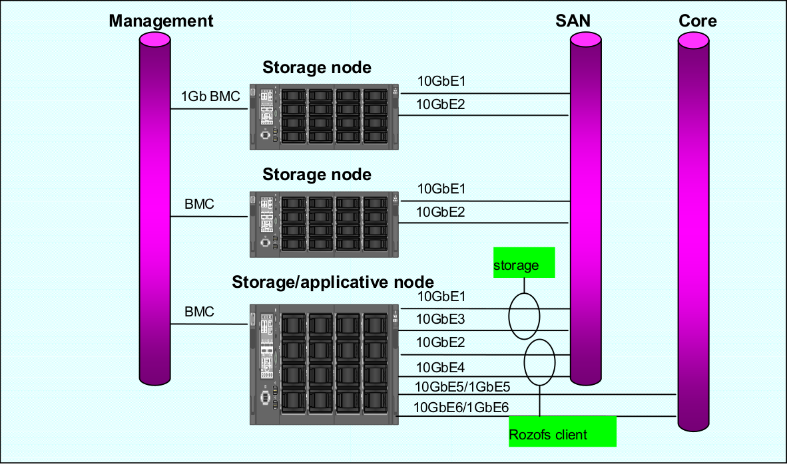

-----------------
Setting up RozoFS
-----------------

Networking Considerations
=========================

Vlan/port Segregation
---------------------

It is recommended to separate core traffic (application) from the SAN
traffic (RozoFS/Storage) with VLANs. It is recommended to use separate
ports for application and RozoFS/Client. When RozoFS and Storage are
co-located, they can share the same ports. However, if there are enough
available ports, it is better that each entity (RozoFS, Storage) has its
own set of ports.

Flow Control (802.3x)
---------------------

It is **mandatory** to enable Flow Control on the switch ports that
handle RozoFS/Storage traffic. In addition, one must also enable Flow
Control on the NICs used by RozoFS/Storage to obtain the performance
benefit. On many networks, there can be an imbalance in the network
traffic between the devices that send network traffic and the devices
that receive the traffic. This is often the case in SAN configurations
in which many hosts (initiators such as RozoFS) are communicating with
storage devices. If senders transmit data simultaneously, they may
exceed the throughput capacity of the receiver. When this occurs, the
receiver may drop packets, forcing senders to retransmit the data after
a delay. Although this will not result in any loss of data, latency will
increase because of the retransmissions, and I/O performance will
degrade.

Spanning-tree Protocol
----------------------

It is recommended to disable spanning-tree protocol (STP) on the switch
ports that connect end nodes (RozoFS clients and storage array network
interfaces). If it is still decide to enable STP on those switch ports,
one need to check for a STP vendor feature, such as PortFast, which
allows immediate transition of the ports into forwarding state.

Storage and RozoFS Network Configuration
----------------------------------------

RozoFS Clients/Storages node connections to the SAN network switches are
always in active-active mode. In order to leverage to Ethernet ports
utilization, the balancing among the ports is under the control of the
application and not under the control of a bonding driver (there is no
need for bonding driver with RozoFS storage node). When operating in the
default mode of RozoFs (no LACP), it is recommended that each SAN port
belongs to different VLANs. Configuration with 802.3ad (LACP) trunks is
supported, however the Ethernet ports usage will not be optimal since
the selection of a port depends on a hash applied either an MAC or IP
level.

Mutli-link Configuration
~~~~~~~~~~~~~~~~~~~~~~~~

That configuration is the recommended one for RozoFS where there is one
separate Vlan per physical port. The following diagram describes how
storage nodes are connected toward the ToR switches. It is assumed that
the RozoFS clients reside on nodes that are connected towards the
northbound of the ToR SAN switches

.. figure:: pics/multi_link_1.png
   :align: center
   :alt: 

LACP Configuration
~~~~~~~~~~~~~~~~~~

In that case, the ports dedicated to the SAN (RozoFS and Storage) are
grouped in one or two LACP groups, depending if we want to separate the
RozoFS and Storage traffic or not. They can be either reside on the same
or different VLANs.

.. figure:: pics/lacp.png
   :align: center
   :alt: 

Preparing Nodes
===============

Exportd Nodes
-------------

Metadata Replication with DRBD
~~~~~~~~~~~~~~~~~~~~~~~~~~~~~~

DRBD replicates data from the primary device to the secondary device in
a way which ensures that both copies of the data remain identical. Think
of it as a networked RAID 1. It mirrors data in real-time, so its
replication occurs continuously. Applications do not need to know that
in fact their data is stored on different disks.

**NOTE**: You must set up the DRBD devices (for store RozoFS metadata)
before creating file systems on them.

To install the needed packages for DRBD see: DRBD website. The following
procedure uses two servers named node1 and node2, and the cluster
resource name r0. It sets up node1 as the primary node. Be sure to
modify the instructions relative to your own nodes and filenames.

To set up DRBD manually, proceed as follows: The DRBD configuration
files are stored in the directory ``/etc/drbd.d/``. There are two
configuration files which are created:

-  ``/etc/drbd.d/r0.res`` corresponds to the configuration for resource
   r0;

-  ``/etc/drbd.d/global_common.conf`` corresponds to the global
   configuration of DRBD.

Create the file ``/etc/drbd.d/r0.res`` on node1, changes the lines
according to your parameters, and save it:

::

    resource r0 {
      protocol C;

      on node1 {
        device     /dev/drbd0;
        disk       /dev/mapper/vg01-exports;
        address    192.168.1.1:7788;
        meta-disk internal;
      }

      on node2 {
        device    /dev/drbd0;
        disk      /dev/mapper/vg01-exports;
        address   192.168.1.2:7788;
        meta-disk internal;
      }
    }

Copy DRBD configuration files manually to the other node:

.. code-block:: bash

    $ scp /etc/drbd.d/* node2:/etc/drbd.d/

Initialize the metadata on both systems by entering the following
command on each node:

.. code-block:: bash

    $ drbdadm -- --ignore-sanity-checks create-md r0

Attach resource r0 to the backing device :

.. code-block:: bash

    $ drbdadm attach r0

Set the synchronization parameters for the DRBD resource:

.. code-block:: bash

    $ drbdadm syncer r0

Connect the DRBD resource with its counterpart on the peer node:

.. code-block:: bash

    $ drbdadm connect r0

Start the resync process on your intended primary node (node1 in this
case):

.. code-block:: bash

    $ drbdadm -- --overwrite-data-of-peer primary r0

Set node1 as primary node:

.. code-block:: bash

    $ drbdadm primary r0

Create an ext4 file system on top of your DRBD device:

.. code-block:: bash

    $ mkfs.ext4 /dev/drbd0

If the install and configuration procedures worked as expected, you are
ready to run a basic test of the DRBD functionality. Create a mount
point on node1, such as ``/srv/rozofs/exports``:

.. code-block:: bash

    $ mkdir -p /srv/rozofs/exports

Mount the DRBD device:

.. code-block:: bash

    $ mount /dev/drbd0 /srv/rozofs/exports

Write a file:

.. code-block:: bash

    $ echo “helloworld” > /srv/rozofs/exports/test

Unmount the DRBD device:

.. code-block:: bash

    $ umount /srv/rozofs/exports

To verify that synchronization is performed:

.. code-block:: bash

    $ cat /proc/drbd
    version: 8.3.11 (api:88/proto:86-96)
    srcversion: 41C52C8CD882E47FB5AF767
     0: cs:Connected ro:Primary/Secondary ds:UpToDate/UpToDate C r-----
        ns:3186507 nr:0 dw:3183477 dr:516201 al:4702 bm:163 lo:0 pe:0 ua:0
        ap:0 ep:1 wo:f oos:0

The two resources are now synchronized (UpToDate). The initial
synchronization is performed, it is necessary to stop the DRBD service
and remove the link for the initialization script not to start the
service automatically DRBD. The service is now controlled by the
Pacemaker service.

Disable DRBD init script (depending on your distribution, here Debian
example):

.. code-block:: bash

    $ /etc/init.d/drbd stop
    $ insserv -vrf drbd

High Availability with Pacemaker
~~~~~~~~~~~~~~~~~~~~~~~~~~~~~~~~

Pacemaker is an open-source high availability resource management tool
suitable for clusters of Linux machines. This tool can detect machine
failures with a communication system based on an exchange of UDP packets
and migrate services (resource) from one server to another.

The configuration of Pacemaker can be done with the ``crm`` command. It
allows you to manage different resources and propagates changes on each
server automatically. The creation of a resource is done with an entry
named primitive in the configuration file. This primitive uses a script
corresponding to the application to be protected.

In the case of the platform, Pacemaker manages the following resources:

-  exportd daemon;

-  The virtual IP address for the exportd service;

-  Mounting the file system used to store meta-data;

-  DRBD resources (r0), roles (master or slave);

-  Server connectivity.

The following diagram describes the different resources configured and
controlled via Pacemaker. In this case, two servers are configured and
node1 is the master server.

.. figure:: pics/DRBD.png
   :align: center
   :alt: 

The first component to configure is Corosync. It manages the
infrastructure of the cluster, i.e. the status of nodes and their
operation. For this, we must generate an authentication key that is
shared by all the machines in the cluster. The ``corosync-keygen``
utility can be use to generate this key and then copy it to the other
nodes.

Create key on node1:

.. code-block:: bash

    # corosync-keygen

Copy the key manually to the other node:

.. code-block:: bash

    $ scp /etc/corosync/authkey root@node2:/etc/corosync/authkey

Besides copying the key, you also have to modify the corosync
configuration file which stored in ``/etc/corosync/corosync.conf``.

Edit your ``corosync.conf`` with the following:

::

    interface {
       # The following values need to be set based on your environment
       ringnumber: 1
       bindnetaddr:192.168.1.0
       mcastaddr: 226.94.1.2
       mcastport: 5407
       ttl: 255
    }

Copy the ``corosync.conf`` manually to the other node:

.. code-block:: bash

    $ scp /etc/corosync/corosync.conf root@node2:/etc/corosync/corosync.conf

Corosync is started as a regular system service. Depending on your
distribution, it may ship with a LSB init script, an upstart job, or a
systemd unit file. Either way, the service is usually named corosync:

.. code-block:: bash

    $ /etc/init.d/corosync start

or:

.. code-block:: bash

    $ service corosync start

or:

.. code-block:: bash

    $ start corosync

or:

.. code-block:: bash

    $ systemctl start corosync

You can now check the Corosync connectivity by typing the following
command:

.. code-block:: bash

    $ crm_mon
    ============
    Last updated: Tue May 2 03:54:44 2013
    Last change: Tue May 2 02:27:14 2013 via crmd on node1
    Stack: openais
    Current DC: node1 - partition with quorum
    Version: 1.1.7-ee0730e13d124c3d58f00016c3376a1de5323cff
    4 Nodes configured, 4 expected votes
    0 Resources configured.
    ============

    Online: [ node1 node2 ]

Once the Pacemaker cluster is set up and before configuring the
different resources and constraints of the Pacemaker cluster, it is
necessary to copy the OCF scripts for exportd on each server. The
exportd script is enable to start, stop and monitor the exportd daemon.

Copy the OCF script manually to each node:

.. code-block:: bash

    $ scp exportd root@node1:/usr/lib/ocf/resource.d/heartbeat/exportd
    $ scp exportd root@node1:/usr/lib/ocf/resource.d/heartbeat/exportd

To set the cluster properties, start the crm shell and enter the
following commands:

.. code-block:: bash

    $ configure property stonith-enabled=false

    $ configure property no-quorum-policy=ignore

    $ configure primitive p_ping ocf:pacemaker:ping \
    params host_list="192.168.1.254" multiplier="100" dampen="5s" \
    op monitor interval="5s"

    $ configure clone c_ping p_ping meta interleave="true"

    $ configure primitive p_drbd_r0 ocf:linbit:drbd params drbd_resource="r0" \
    op start timeout="240" \
    op stop timeout="100" \
    op notify interval="0" timeout="90" \
    op monitor interval="10" timeout="20" role="Master" \
    op monitor interval="20" timeout="20" role="Slave"

    $ configure ms ms_drbd_r0 p_drbd_r0 \
    meta master-max="1" master-node-max="1" \
    clone-max="2" clone-node-max="1" notify="true" \
    globally-unique="false"

    $ configure location loc_ms_drbd_r0_needs_ping \
    ms_drbd_r0 rule -inf: not_defined pingd or pingd lte 0

    $ configure primitive p_vip_exportd ocf:heartbeat:IPaddr2 \
    params ip="192.168.1.10" nic="eth0" cidr_netmask=24 \
    op monitor interval="30s"

    $ configure primitive p_fs_exportd ocf:heartbeat:Filesystem \
    params device="/dev/drbd0" directory="/srv/rozofs/exports" fstype="ext4" \
    options="user_xattr,acl,noatime" \
    op start timeout="60" \
    op stop timeout="60" \
    op monitor interval="10s" timeout="40s"

    $ configure primitive exportd_rozofs ocf:heartbeat:exportd \
    params conffile="/etc/rozofs/export.conf" \
    op monitor interval="20s"

    $ configure group grp_exportd p_fs_exportd p_vip_exportd exportd_rozofs

    $ configure colocation c_grp_exportd_on_drbd_rU \
    inf: grp_exportd ms_drbd_r0:Master

    $ configure order o_drbd_rU_before_grp_exportd \
    inf: ms_drbd_r0:promote grp_exportd:start

    $ configure location loc_prefer_grp_exportd_on_node1 \
    grp_exportd 100: node1

Once all the primitives and constraints are loaded, it is possible to
check the correct operations of the cluster with the following command:

.. code-block:: bash

    $ crm_mon -1

    ============
    Last updated: Wed May 2 02:44:21 2013
    Last change: Wed May 2 02:43:27 2013 via cibadmin on node1
    Stack: openais
    Current DC: node1 - partition with quorum
    Version: 1.1.7-ee0730e13d124c3d58f00016c3376a1de5323cff
    2 Nodes configured, 2 expected votes
    5 Resources configured.
    ============

    Online: [ node1 node2 ]

     Master/Slave Set: ms_drbd_r0 [p_drbd_r0]
         Masters: [ node1 ]
         Slaves: [ node2 ]
     Resource Group: grp_exportd
         p_fs_exportd       (ocf::heartbeat:Filesystem):    Started node1
         p_vip_exportd      (ocf::heartbeat:IPaddr2):       Started node1
         exportd_rozofs     (ocf::heartbeat:exportd):       Started node1
     Clone Set: c_ping [p_ping]
         Started: [ node1 node2 ]

Storaged Nodes
--------------

Storaged Storaged nodes should have appropriate free space on disks. The
storaged service stores transformed data as files on a common file
system (ext4). It is important to dedicate file systems used by storaged
service exclusively to it (use a Logical Volume or dedicated partition).
It is necessary to manage the free space properly.

Configuration Files
===================

Exportd Configuration File
--------------------------

The configuration file of exportd (``export.conf``) consists of 3 types
of information :

-  the redundancy configuration chosen (layout)

-  the list of storage volumes used to store data (volumes)

-  list of file systems exported (exports)

Redundancy Configuration (layout): the **layout** allows you to specify
the configuration of redundancy RozoFS. There are 3 redundancy
configurations that are possible :

-  layout=0; cluster(s) of 4 storage locations, 3 are used for each
   write and 2 for each read

-  layout=1; cluster(s) of 8 storage locations, 6 are used for each
   write and 4 for each read

-  layout=2; cluster(s) 16 storage locations, 12 are used for each write
   and 8 for each read

List of storage volumes (volumes): The list of all the storage
**volumes** used by exportd is grouped under the volumes list. A volume
in the list is identified by a unique identification number (VID) and
contains one or more **clusters** identified by a unique identification
number (CID) consisting of 4, 8 or 16 storage locations according to the
layout you have chosen. Each storage location in a cluster is defined
with the SID (the storage unique identifier within the cluster) and its
network name (or IP address).

List of exported file systems (exports): The exportd daemon can export
one or more file systems. Each exported file system is defined by the
absolute path to the local directory that contains specific metadata for
this file system.

Here is the an example of configuration file (``export.conf``) for
exportd daemon:

.. code-block:: bash

    # rozofs export daemon configuration file

    layout = 0 ; # (inverse = 2, forward = 3, safe = 4)

    volumes = # List of volumes
    (
        {
            # First volume
            vid = 1 ; # Volume identifier = 1
            cids=     # List of clusters for the volume 1
            (
                {
                    # First cluster of volume 1
                    cid = 1;  # Cluster identifier = 1
                    sids =    # List of storages for the cluster 1
                    (
                        {sid = 01; host = "storage-node-1-1";},
                        {sid = 02; host = "storage-node-1-2";},
                        {sid = 03; host = "storage-node-1-3";},
                        {sid = 04; host = "storage-node-1-4";}
                    );
                },
                {
                    # Second cluster of volume 1
                    cid = 2; # Cluster identifier = 2
                    sids =   # List of storages for the cluster 2
                    (
                        {sid = 01; host = "storage-node-2-1";},
                        {sid = 02; host = "storage-node-2-2";},
                        {sid = 03; host = "storage-node-2-3";},
                        {sid = 04; host = "storage-node-2-4";}
                    );
                }
            );
        },
        {
            # Second volume
            vid = 2; # Volume identifier = 2
            cids =   # List of clusters for the volume 2
            (
                {
                    # First cluster of volume 2
                    cid = 3; # Cluster identifier = 3
                    sids =   # List of storages for the cluster 3
                    (
                        {sid = 01; host = "storage-node-3-1";},
                        {sid = 02; host = "storage-node-3-2";},
                        {sid = 03; host = "storage-node-3-3";},
                        {sid = 04; host = "storage-node-3-4";}
                    );
                }
            );
        }
    );

    # List of exported filesystem
    exports = (

      # First filesystem exported
      {eid = 1; root = "/srv/rozofs/exports/export_1"; md5="AyBvjVmNoKAkLQwNa2c";
       squota="128G"; hquota="256G"; vid=1;},
      # Second filesystem exported
      {eid = 2; root = "/srv/rozofs/exports/export_2"; md5="";
      squota=""; hquota = ""; vid=2;}
    );

Storaged Configuration File
---------------------------

The configuration file of the **storaged** daemon (``storage.conf``)
must be completed on each physical server storage where storaged daemon
is used. It contains two informations:

-  ports; list of TCP ports used to receive requests to write and read
   from clients using rozofsmount

-  storages; list of local storage locations used to store the
   transformed data (projections)

List of local storage locations (storages): All of storage locations
used by the storaged daemon on a physical server are grouped under the
storages list. The storages list consists of one or more storage
locations. Each storage location is defined by the CID (unique
identification number of the cluster to which it belongs) and SID (the
storage unique identifier within the cluster) and the absolute path to
the local directory that will contain the specific encoded data for this
storage.

Configuration file example (``storage.conf``) for one storaged daemon:

.. code-block:: bash

    # rozofs storage daemon configuration file.

    # listen: (mandatory)
    #   Specifies list of IP(s) (or hostname(s)) and port(s) the storio
    #   process should listen on for receive write and read requests from
    #   clients.

    listen = (
       {
          addr = "*";
          port = 41001;
       }
    );

    # storages:
    #   It's the list of local storage managed by this storaged.

    storages = (
      {cid = 1; sid = 1; root = "/srv/rozofs/storages/storage_1-1";},
      {cid = 2; sid = 1; root = "/srv/rozofs/storages/storage_2-1";}
    );

